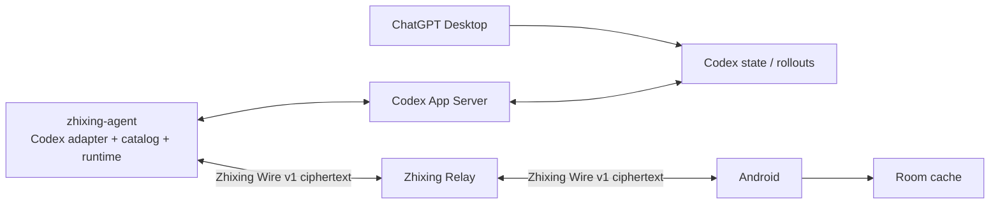

# 知行 0.2.0：Codex 原生工作架构

状态：Accepted baseline
日期：2026-07-19
跟踪：GitHub Issue #49

## 1. 要解决的问题

0.1.x 的“工作”模块以 Happy Session 为核心。项目由 `machineId + path` 临时聚合，只有经过 Happy 创建或恢复的 Codex Thread 才会进入手机端。结果是 Codex Thread、Happy Session、仓库预设和前端会话同时表达同一件事，历史、状态和恢复语义容易漂移。

0.2.0 把产品重新定义为 Codex 原生移动客户端：

- Codex App Server 的 Thread / Turn / Item 是工作会话的事实来源。
- 手机能按项目浏览 Codex Desktop/CLI 已落盘的历史 Thread，并继续同一 Thread。
- zhixing-agent 负责适配 Codex 版本和建立实时运行桥。
- 自托管 Relay 只负责身份、机器信令、端到端加密盲转发、离线密文和通知。
- Android 使用原生“项目 → 对话 → 消息/审批”交互，不暴露 Happy 技术对象。

## 2. 已锁定的决策

1. 0.2.0 只做 Codex。Claude Code 新建和执行入口冻结，旧记录只读保留。
2. 不把 ChatGPT Desktop UI、SQLite 或 `.codex-global-state.json` 作为正式运行接口。
3. Agent 通过本机 stdio 连接 Codex App Server；手机不直接连接开发机端口。
4. Happy 不再是目标协议或业务模型。0.1.13、旧 Relay 数据和服务器快照只用于只读与回滚。
5. Android 不直接依赖 Codex 实验协议；Agent 输出版本化 Zhixing Wire v1。
6. 同一 `machineId + codexThreadId` 永远是同一产品对话。运行桥重建不能产生重复对话。
7. `main` 始终可部署；0.2.0 通过默认关闭的短分支增量合并，功能冻结后才创建 `release/0.2.0`。

## 3. 当前链路

当前限制：

- `WorkSession` 是 Happy Session，不是 Codex Thread。
- `WorkflowProject` 从现有 Session 的路径推导，没有独立 Project 事实。
- Agent 只实现 `thread/start`、`thread/resume` 和 `turn/start`，没有目录同步。
- Relay 部署只是 `happy-server-self-host` 的包装镜像。
- 首页仍同时展示运行态、仓库预设和最近会话，配置与内容混杂。

## 4. 目标链路

### 4.1 Codex App Server

拥有 Thread、Turn、Item、审批、归档、删除和恢复语义。0.2.0 的适配基线为本机生成的 `codex-cli 0.144.0` schema，但运行时必须握手并按 capability 降级，不能假定所有字段永久稳定。

### 4.2 zhixing-agent

Agent 是唯一 Codex 协议适配层：

- 启动本机 App Server stdio 子进程。
- 生成/校验 schema hash 与能力表。
- 分页读取 Thread 目录和按需读取 Turn/Item。
- 将 CWD 归一为 Project。
- 把 Codex 事件映射为稳定 Wire 事件。
- 处理 start/resume/fork/steer/interrupt/archive/delete/approval。
- 为 Agent 接管的 Thread 维护唯一 RuntimeBinding。

### 4.3 Zhixing Relay

Relay 不理解 Codex 内容，仅承担：

- 账户挑战认证、设备配对和撤销。
- Android/Agent 在线状态与目标路由。
- 幂等密文 envelope、ACK、短期 outbox 和离线快照。
- RPC 超时、推送触发、健康检查、备份和恢复。

Relay 不得记录项目路径、Thread 标题、消息正文、工具参数、Codex/ChatGPT 凭据或恢复种子。

### 4.4 Android

Room 是已解密数据的本机缓存，不是服务端真相。UI 只订阅 Project、Thread、Turn/Item、RuntimeBinding、Approval 和同步状态；不得重新拼装第二份会话状态。

## 5. 领域对象

### Machine

- `machineId`：随机稳定 ID。
- display name、platform、Agent/Codex 版本和 capabilities。
- Relay presence 与最后在线时间。

### Project

- `projectId`：Agent 持久化随机 UUID；确定性恢复场景使用 keyed HMAC，禁止裸路径哈希。
- `machineId`、加密 canonical root、display name、VCS 元数据、最近活动。
- 路径归一处理 Windows 盘符大小写、`\\?\`、分隔符、尾斜杠、WSL 映射和 Git root。
- 无法安全归一时保留原始 CWD 并进入“其他目录”，不得错误合并。

### Thread

- 业务主键：`machineId + codexThreadId`。
- Project、name/preview、created/updated/recency、archived、source、parent/fork 关系。
- `parentThreadId != null` 的 subagent 挂在父 Thread 内，不占主列表。
- Automation 独立标记和筛选，默认不占项目首页。

### RuntimeBinding

- 表示 Agent 当前加载的 Thread 和实时事件连接。
- 不创建另一条产品会话。
- 同一机器/Thread 最多一个写入 binding；重复请求重连现有 binding。

### ProjectPolicy

默认模型、思考深度、审批/沙箱和分支等配置。它属于设置，不是 Project 内容，也不在工作首页展示。

## 6. Desktop 集成边界

Windows 真机验证结果：

- 独立 App Server 可以在 Desktop 运行时 `thread/list` 和 `thread/read(includeTurns=true)`，读取真实名称、CWD、父子关系、Turn/Item 和已落盘状态。
- Desktop 内置 App Server 是其 stdio 子进程，没有可复用的 TCP/Unix 控制端点。
- 第二个 App Server对 Desktop 已加载的 Thread 返回 `notLoaded`，不能订阅第一个进程的实时事件。

因此：

- Desktop/CLI 已落盘项目和历史可以自动同步。
- Agent 启动或恢复的 Thread 支持完整实时控制。
- Desktop 独立启动的活动 Thread 只能展示最后确认的历史；状态必须标为“桌面状态未知”，不能伪装在线。
- 状态未知的 Desktop Thread 在 resume 前要求确认，避免两个 App Server 并发驱动。
- 不用 tail 私有 JSONL、注入 Desktop stdio 或读取私有 SQLite 来伪造实时能力。

## 7. Android 信息架构

### 工作首页

- 顶栏：工作、搜索、设置。
- 仅有审批、失败或完成时显示紧凑“需要处理”。
- 主体是纵向 Project 列表：项目名、最近 Thread 摘要、更新时间、在线/离线文字状态。
- FAB 新建任务。
- 不展示恢复密钥、中继协议、机器诊断、模型权限或仓库预设卡。

### Project 页

- 项目名和新建任务是主层级。
- 筛选：全部、进行中、已完成、已归档；Automation 为二级筛选。
- Thread 行显示标题、最近 Agent 摘要、时间和状态，不显示内部 ID。
- subagent 在父 Thread 内折叠为“子任务 n”。
- 路径、机器、Git root 和默认策略放入项目信息抽屉。

### Thread 页

- 首屏直接显示消息流，移除大块 `SessionTargetCard`。
- AppBar 显示自适应标题和 Project 副标题；停止、归档、删除、诊断进入 overflow。
- Agent 正文为主；工具活动折叠，思考和原始日志退居二级。
- 审批卡内联展示目标、风险和允许一次/拒绝；状态不能只靠颜色。
- 输入区保留草稿。开发机离线时禁止发送且不自动排队。
- 运行中发送映射为 steer；空闲时映射为普通 turn。

### 新建任务与设置

新建任务默认只显示 Project、任务描述和开始；模型、思考深度、权限、分支放入高级设置。用户可见设置称为“开发环境”，Happy 字样退出 0.2.0 主 UI。

## 8. 状态和降级

- 手机离线：Room 只读、展示最后同步时间、保留草稿。
- Relay 不可达：历史可读并允许重试。
- 开发机离线：执行禁用，历史和搜索可用。
- Agent/Codex 不兼容：只读目录并提示升级 Agent。
- 单 Thread 读取或解密失败：隔离对象，不清空其他项目。
- 未知 Item：进入诊断层的 opaque fallback，不导致整条 Thread 无法读取。

## 9. 安全边界

- Wire v1 使用独立域分离和新密文 bundle；不与 Happy v0 密文混写。
- 每条密文使用 AES-256-GCM，AAD 绑定 envelope 路由和序号。
- data key 通过设备 X25519/NaCl box 封装；恢复种子和设备私钥永不上传。
- Relay compromise 的保密承诺只覆盖正文；流量时间、大小、账户和路由元数据仍可见。
- 已配对恶意设备、开发机本身被攻破和上游账号封禁不在 Relay 保密承诺内。

## 10. 迁移与回滚

- 0.2.0 新链路在完整闭环前默认关闭，不占用正式工作入口。
- Happy 数据只读保留，不自动转换成 Codex 事实。
- 切换失败时回到 0.1.13 客户端/Agent/Happy Relay；不删除新 Relay 密文、旧 Happy 数据或本机 Codex Thread。
- 新 Relay 完成真实备份恢复和回滚演练后，才允许下线 Happy 容器。

## 11. 非目标

- Claude Code 账号或协议兼容。
- 操作 ChatGPT Desktop UI。
- 手机直连开发机端口。
- 完整移动 IDE、多 Agent 编排、生产环境静默危险操作。
- 为追求实时旁观而依赖 Codex 私有数据库或未承诺的 Desktop 内部协议。

## 12. 产品验收

1. 手机按 Project 浏览 Desktop/CLI 已落盘主 Thread 和历史，不受 Happy 活跃窗口限制。
2. 开发机离线时历史、搜索和草稿可用；上线后由用户明确发送。
3. 恢复历史后继续同一 Codex Thread，不产生重复产品会话。
4. Agent 接管的 Thread 支持正文、工具、审批、steer、interrupt 和完成状态实时闭环。
5. Relay 无法读取路径、标题、正文和工具参数；重复、乱序和重放不制造重复状态。
6. Codex 变化由 Agent capability/schema 适配，旧 Android 明确只读降级。
7. 0.1.13 和旧服务器快照可完成可验证回滚。
