# 知行 Codex 原生会话：协议、交互与实现合同

状态：Accepted implementation contract
日期：2026-07-19
跟踪：GitHub Issue #49
适用基线：Android / Agent / Relay `v0.2.1` 之后的 0.2.x 打磨

## 1. 产品结论

“工作”不是 Codex 任务监控器，也不是 Happy 会话浏览器。目标是在知行 Android 中，获得与 Codex
桌面应用同一类的持续开发体验：选择一个项目和历史任务，看到完整上下文，发送文本、图片、文件、
Skill 或 mention，选择模型、思考深度、Fast 和访问权限，并持续收到正文、思考、计划、工具、文件修改、
审批、用量和错误。

Codex 只替换知行既有聊天体系的**运行后端**，不得替换它的聊天交互和渲染资产：

- 输入壳沿用知行现有 `ChatInputState`、附件、语音、IME、发送与停止交互；
- 消息统一投影为 `UIMessage / UIMessagePart`；
- Markdown、代码高亮、图片/文件、思考、工具、审批继续由现有消息组件渲染；
- 历史恢复和实时增量进入同一投影器，不能形成两套展示结果；
- Codex Thread 是事实来源，Room 只是加密内容在手机上的已解密缓存；
- 项目与历史用于组织工作，在线状态用于辅助判断，不能取代聊天本身。

0.2.1 基线中的 `CodexThreadPage` 曾使用自制纯文本 Item 气泡和 `OutlinedTextField`；本合同要求删除这套
迁移脚手架，当前 0.2.x 实现已切换到共享输入与消息组件。

## 2. 用户问题与验收口径

### 2.1 要解决的问题

1. 手机能看见 Desktop/CLI 已落盘的项目和历史 Thread，而不是只看最近活跃任务。
2. 打开历史 Thread 立即看到完整消息，不需要另开对话询问“之前做到哪”。
3. 手机继续同一 Thread 时，输入能力和 Codex 参数不能比桌面端显著残缺。
4. AI 的正文、思考、工具和文件修改要进入正常聊天流，不能只在“完整日志”中刷屏。
5. 网络或开发机临时离线时，历史、搜索和草稿仍可用；恢复后可以明确重试。

### 2.2 P0 验收

- 文本、图片和通用文件可发送；图片以 Codex 原生 image/localImage 输入进入 Turn。
- 模型和思考深度来自当前 Agent 运行的 Codex `model/list`，按模型动态校验。
- 支持 `priority` Fast、权限 Profile、Skill 和 mention；插件/App 至少可列出并显示实际可用状态。
- 历史中的用户、助手、思考、命令、文件修改、MCP、Web Search 和协作工具得到结构化展示。
- 实时回答、思考、命令输出、文件变更和工具进度在现有聊天流中增量更新。
- 显示当前模型、思考深度、Fast、权限和上下文用量；展示的是 App Server 确认值，不是手机猜测值。
- 空闲发送创建 Turn，运行中发送使用 steer；停止使用 interrupt。
- 审批内联到相应工具步骤；批准、拒绝、取消与 App Server 决策一一对应。

## 3. 调研一：Desktop、CLI 与 App Server 的真实边界

### 3.1 已验证事实

2026-07-19 在当前 Windows 开发机完成以下验证：

- ChatGPT Desktop 内置运行时实际启动
  `codex.exe -c features.code_mode_host=true app-server --analytics-default-enabled`。
- Desktop 随附 `codex.exe` 与 `%LOCALAPPDATA%/OpenAI/Codex/bin/.../codex.exe` 哈希一致，版本为
  `0.144.0-alpha.4`；npm `@openai/codex` 运行时为 `0.144.0`。
- Desktop 与 npm CLI 生成的 337 个 app-server schema 单文件一致，属于同一 v2
  Thread/Turn/Item 协议家族。
- Desktop 内置 App Server 是私有 stdio 子进程，没有可附着的 TCP/Unix 端点。独立 App Server 当前也提供
  WebSocket listen 模式，但知行 Agent 为避免额外暴露本机端口，仍启动自己的本地 stdio App Server；手机不能
  直接接到 Desktop 进程。
- 第二个 App Server 可以通过相同 `CODEX_HOME` 读取 Desktop/CLI 已落盘的 Thread、Turn 和 Item。
- 第二个 App Server 无法订阅 Desktop 当前私有进程中的实时运行事件。Desktop 正在执行的 Thread 在
  独立进程中可能表现为 `notLoaded`，继续前必须由用户确认接管。
- 对真实历史 Thread 调用 `thread/read(includeTurns=true)` 可以返回完整历史；“手机无历史”不是 Codex
  上游不保存，而是当前 Wire 请求、快照和 Android 展示链路的问题。

### 3.2 当前运行时能力

本机运行时已验证：

- 模型目录：`model/list` 返回模型标识、展示名、输入模态、支持的思考档位和 service tier。
- 当前模型包含 `gpt-5.6-sol`、`gpt-5.6-terra`、`gpt-5.6-luna`、`gpt-5.5`、
  `gpt-5.3-codex-spark`；不能把这份快照硬编码为长期列表。
- 思考档位不是封闭枚举。不同模型支持 `low` 到 `xhigh/max/ultra` 的不同子集。
- Fast 对应 `serviceTier=priority`，不是模型名或本地 UI 假状态。
- 权限使用 `permissionProfile/list` 的 profile，并由 Thread/Turn 响应确认实际
  `activePermissionProfile`、sandbox 和 approval policy。
- `skills/list` 按 CWD 动态返回 Skill；`plugin/list/read/install` 和 `app/list` 是独立能力。`app/list` 与
  `item/tool/requestUserInput` 属于实验能力，Agent 初始化时必须声明 `experimentalApi=true`。
- `thread/tokenUsage/updated` 返回本轮、总用量和 `modelContextWindow`。
- `thread/turns/list` 可分页读取历史；`thread/items/list` 在当前运行时虽然出现在 schema 中，但实测返回
  “not supported yet”，不能作为 P0 历史依赖。

### 3.3 输入协议

`turn/start.input` 的当前 `UserInput` 变体包括：

- `text`：文本；
- `image`：URL + detail；
- `localImage`：开发机本地绝对路径 + detail；
- `skill`：name + path；
- `mention`：name + path。

没有通用 `file` 变体。手机文件必须先通过 Wire 加密上传到 Agent 临时区，再由 Agent 写入开发机受控目录，
随后以 mention/path 和配套文本提交。图片优先走 `localImage`。临时文件必须有大小、MIME、哈希、生命周期和
清理合同。

### 3.4 结论

当前方向并不是“用了错误的 CLI 协议”。Desktop 和 CLI 共享同一 App Server 协议家族；问题是
zhixing-agent 只包了极小子集，Android 又在其上重做了一套纯文本页面。修复重点是扩大适配器、保留结构和
复用知行聊天体系，而不是抓取 Desktop 私有 SQLite、模拟 UI 或回到 Happy。

## 4. 调研二：知行已有聊天链路与当前偏差

### 4.1 已有成熟链路

```text
ChatPage
  -> ChatInput / ChatInputState
  -> List<UIMessagePart>
  -> ChatService / GenerationHandler
  -> streaming MessageChunk merge
  -> Conversation / MessageNode
  -> ChatList
  -> ChatMessage / MessagePartsBlock
  -> MarkdownBlock / Reasoning / Tool UI / attachments
```

现有能力不是若干零散组件，而是一套完整显示协议：

- `ChatInputState` 保存文本、图片、视频、音频、文档、编辑状态和托管附件清理语义；
- `ChatInput` 包含模型、思考、搜索、附件、语音、发送、停止、键盘和无障碍交互；
- `UIMessage.appendChunk` 能按顺序合并 Text、Image、Reasoning 和带稳定 ID 的 Tool；
- `MessagePartsBlock` 保留 Part 顺序，把连续 Reasoning/Tool 组合为 Chain of Thought；
- 助手正文和思考都用 `MarkdownBlock`，生成中避免 SelectionContainer 并发问题；
- Tool UI 已有 loading、审批、问答、图片输出、专用 renderer 和通用 fallback；
- `WorkUiMapper` 已证明远程协议消息可以映射为 `UIMessagePart` 并复用同一渲染资产。

### 4.2 0.2.1 基线 Codex 页的问题

实施前链路是：

```text
ThreadDetailPayload
  -> CodexTurn / CodexItem(text/status)
  -> flatMap(items)
  -> CodexItemRow(Text)

draft: String
  -> OutlinedTextField
  -> RuntimeCommandPayload(text)
```

其损失包括：

- `normalizeThreadDetail` 把 image/localImage 压成 `[图片]`；
- reasoning、command、fileChange、MCP 等只保留摘要文本；
- `CodexItem.raw` 在落入 Android 领域模型前被丢弃；
- 只处理 agentMessage delta，忽略 reasoning、plan、command output、file patch、MCP progress、token usage、
  settings 和 model reroute 等通知；
- Thread start/resume 返回的实际模型、effort、service tier、权限、sandbox 和 approval policy 被丢弃；
- 输入只有 text，没有附件、Skill、mention 或运行参数；
- Thread 页自己渲染纯文本，绕过 Markdown、思考、工具和附件；
- 历史只在首次进入时发送一次 `thread.detail`，失败被 `runCatching` 吞掉，没有可见状态和自动重试；
- 完整历史以单个 envelope 发布，存在 Relay 3 MiB 上限和弱网失败风险。

## 5. 目标架构

```mermaid
flowchart LR
    Desktop["ChatGPT Desktop / Codex CLI"] --> State["CODEX_HOME rollouts"]
    State <--> AppServer["Codex App Server v2"]
    AppServer <--> Adapter["zhixing-agent Codex adapter"]
    Adapter <--> Projector["Wire event and snapshot projector"]
    Projector <-->|"Wire v1 E2E ciphertext"| Relay["Blind Relay"]
    Relay <-->|"Wire v1 E2E ciphertext"| Android["Android Wire client"]
    Android --> Cache["Room cache: Codex facts"]
    Cache --> ConversationAdapter["CodexConversationAdapter"]
    ConversationAdapter --> ChatUI["Existing Chat timeline and composer"]
```



### 5.1 唯一事实来源

- Codex Thread/Turn/Item 是远程开发对话事实。
- `(machineId, threadId)` 是产品主键；不得另造一个本地 Conversation ID 表示同一 Thread。
- Room 保存规范化 Codex 对象、opaque raw 和本地整理偏好，不能把它们复制成普通 Provider Conversation。
- UI 可把 Codex 消息临时包装为 `UIMessage/MessageNode`，但这些是 projection，不反向覆盖 Codex 历史。

### 5.2 共享 UI 分层

目标不是让 Codex 直接进入现有 `ChatService` Provider 生成链，而是提取两层共享资产：

1. `ChatTimeline`：接收稳定的 `MessageNode/UIMessage` 视图和动作 capability；
2. `ChatComposer`：接收 `ChatInputState`、模型/思考/权限等展示模型，以及发送/停止/附件回调。

本地 Provider Chat 和 Codex Runtime 分别提供 controller。这样复用交互和视觉，但不混淆持久化、分支、生成、
工具执行和事实来源。

## 6. Wire 领域合同

### 6.1 Runtime settings

Thread detail、start/resume 响应和 settings update 必须保留：

```json
{
  "model": "gpt-5.6-sol",
  "reasoningEffort": "high",
  "serviceTier": "priority",
  "permissionProfile": ":workspace",
  "approvalPolicy": "on-request",
  "sandbox": "workspace-write",
  "cwd": "C:\\repo",
  "tokenUsage": {
    "last": 0,
    "total": 0,
    "modelContextWindow": 262144
  }
}
```

Android 展示最近一次 App Server 确认值。命令发出后只能显示“正在切换”，收到响应或通知后才更新为实际值。

### 6.2 Catalogs

Agent 按 CWD 提供：

- `model.catalog`：模型、展示名、输入模态、efforts、tiers、默认值；
- `permission.catalog`：profile ID、展示名、风险说明和实际 sandbox/approval 结果；
- `skill.catalog`：name、path、description、enabled；
- `plugin.catalog` / `app.catalog`：已安装、可用、授权或不可用状态。

Catalog 带 revision、generatedAt 和 capability。未知字段前向兼容；更高 required capability 禁止写入但保留只读。

### 6.3 Composer payload

```json
{
  "command": "turn.start",
  "machineId": "machine",
  "threadId": "thread",
  "input": [
    {"type": "text", "text": "修复截图中的问题"},
    {"type": "localImage", "path": "C:\\...\\uploads\\opaque\\screen.png", "detail": "auto"},
    {"type": "skill", "name": "ui-review", "path": "C:\\...\\SKILL.md"}
  ],
  "model": "gpt-5.6-sol",
  "effort": "high",
  "serviceTier": "priority",
  "permissions": ":workspace"
}
```

手机先用 `attachment.upload` 分片传输本机 URI 内容。Agent 在 E2E 解密、大小/MIME/SHA-256 校验完成后返回
受控临时路径，Android 才把该路径作为 app-server `localImage` 或 `mention` 放进结构化输入；用户不能手填
开发机路径。开发机历史中的 `localImage` 则通过 `attachment.download` 按 Thread 引用白名单取回。

### 6.4 Thread snapshot

- 使用 `thread/read(includeTurns=true)` 或 `thread/turns/list(itemsView=full)` 读取；不依赖当前不支持的
  `thread/items/list`。
- 快照按受控 UTF-8 字节大小分块，携带 detailId、machineId、threadId、chunkIndex/count、chunkHash、
  contentHash 和 contentBase64。
- Android 只有在全部块校验成功后才原子替换旧 revision；失败继续展示旧历史并重试缺块。
- Item 必须保存 `id/type/status`、结构化 raw 和兼容用 text；不得只保存纯文本。raw 只在 E2E 密文和已配对设备
  本地 Room 中保存，日志不得输出明文 payload。

### 6.5 Runtime event

所有 Runtime 事件保留 `threadId/turnId/itemId/type/at/payload`；Wire envelope 的 per-stream `seq` 负责去重与
gap 检测。至少覆盖：

- turn started/completed；
- item started/completed；
- agent message delta；
- reasoning summary/text delta 与 part added；
- plan delta/updated；
- command output delta；
- file output/patch delta；
- MCP/tool progress；
- token usage；
- thread settings、model reroute 和 error；
- approval requested/resolved。

App Server 的原始 delta 先在 Agent 按 itemId 合并，再作为累计 Item snapshot 发布；Android 对同一 itemId 做幂等
upsert。这样重复 envelope 不会重复拼字，seq gap 会触发完整 `thread.detail` 重同步。

## 7. Codex 到知行消息的映射

| Codex Item / event | UI 投影 | 展示规则 |
|---|---|---|
| `userMessage.text` | `UIMessagePart.Text` | 用户气泡，Markdown 按现有规则 |
| `userMessage.image/localImage` | `UIMessagePart.Image` | 通过加密附件缓存展示；不可取时显示带状态的附件占位 |
| `skill` / `mention` | Text + metadata/chip | 保留 name/path 身份，正文不只显示 `$name` 字符串 |
| `agentMessage` | `UIMessagePart.Text` | 现有 Markdown、代码高亮、引用和选择复制 |
| `reasoning` | `UIMessagePart.Reasoning` | 流式预览、完成后折叠、显示耗时 |
| `plan` | `UIMessagePart.Tool(toolName=update_plan)` | 结构化计划卡；无 renderer 时走通用 Tool fallback |
| `commandExecution` | `UIMessagePart.Tool` | command/input、增量输出、状态、审批 |
| `fileChange` | `UIMessagePart.Tool` | 文件路径、diff/patch、状态、审批 |
| `mcpToolCall` | `UIMessagePart.Tool` | namespace/tool/input/output/progress |
| `dynamicToolCall` | `UIMessagePart.Tool` | 稳定 itemId 作为 toolCallId |
| `collabAgentToolCall` | `UIMessagePart.Tool` | 子任务标题、状态与结果，不平铺为独立主对话 |
| `webSearch` | `UIMessagePart.Tool(search_web)` | 搜索过程与结果；正文引用仍由 Markdown 展示 |
| compaction/review/reroute | 系统 Note 或 metadata | 仅有用户意义时显示，诊断信息不污染正文 |
| approval request | 对应 Tool 的 Pending 状态 | 内联允许/拒绝/取消；找不到 Item 时才使用独立 fallback 卡 |

投影必须保留 Item 原始顺序。Reasoning 和 Tool 连续出现时沿用现有 Chain of Thought 分组；正文前后顺序不能
被按类型重排。

## 8. 流式与历史统一

### 8.1 Reducer

`CodexMessageProjector` 接收统一的 `CodexThreadDetail`：

- 完整 Thread snapshot 写入的结构化 Item；
- `CodexRuntimeItemReducer` 将 RuntimeEvent 合并后写入的同形 Item；
- command result 产生的设置、用量和审批状态。

输出是稳定 `List<CodexMessageBlock>`，内部直接承载既有 `UIMessagePart`。Item ID 作为 Part 身份；Turn ID 作为
消息分组边界。
实时增量与历史重放必须得到相同投影，测试使用同一 fixture 比较最终结构。

### 8.2 合并规则

- Agent 累计 text/reasoning snapshot upsert 到同一 Part，不为每个 delta 新建消息；
- Tool 以 Item ID 更新 input/output/status/approval，不能通过标题猜测配对；
- item completed 关闭相应 loading；turn completed 兜底关闭未完成 reasoning/tool；
- 完整 detail 的全部块校验后原子替换旧 Turn/Item；未完成 detail 不覆盖旧历史；
- 重复事件幂等，gap 触发 snapshot refresh，不猜测缺失文本；
- App 重启后从 Room 恢复历史、草稿、revision 和最后连续 sequence。

## 9. 输入区合同

### 9.1 必须复用

Codex Thread 页使用与普通聊天一致的输入容器、文本编辑、附件预览、语音、发送/停止、IME 和安全区处理。
不允许维护第二个纯文本 `draft: String + OutlinedTextField` 体系。

### 9.2 必须解耦

现有 `ChatInput` 直接依赖 `Settings/Assistant/Provider Model`，需提取数据驱动接口：

```kotlin
data class ChatComposerOptions(
    val models: List<ComposerModelOption>,
    val selectedModel: String?,
    val reasoningEfforts: List<ComposerReasoningOption>,
    val selectedEffort: String?,
    val fastEnabled: Boolean,
    val permissionProfiles: List<ComposerPermissionOption>,
    val selectedPermissionProfile: String?,
    val skills: List<ComposerSkillOption>,
    val contextUsage: ComposerContextUsage?,
)
```

普通 Provider Chat 用 Adapter 把 `Settings/Assistant/Model` 转成该模型；Codex 用 `model/list` 等 catalog 转换。
现有 `ReasoningLevel` 只到 `xhigh`，不能作为 Codex 协议枚举；UI 使用服务端广播字符串和展示标签。

### 9.3 参数行为

- 模型切换只展示该模型支持的 effort 和输入模态；不支持图片的模型在发送前给出明确错误。
- Fast 是可见 toggle，并显示服务端确认状态。
- 权限 Profile 是每个 Thread/Turn 的真实设置；危险档位切换继续使用明确确认。
- 上下文长度显示已用/窗口和最近更新时间，不用手机估算替代服务端值。
- Skill/mention 使用动态 catalog，选择后以结构化 Part 留在输入区，可单独删除。
- 运行中发送按钮语义为“补充要求”；空闲为“发送”；同一位置显示停止能力。

## 10. 页面交互

### 工作首页

- 只展示置顶项目和有限最近项目；完整目录进入“管理全部”。
- 项目整理、归档、重点和搜索继续存在，但不把机器指标和运行日志堆在首页。
- “需要处理”只作为快捷入口，不是页面主叙事。

### Project 页

- 以当前、重点、归档组织历史 Thread；subagent 挂在父 Thread。
- Thread 行以标题、最后正文摘要和更新时间为主；状态是辅助信息。
- 新建任务从项目上下文启动，并使用同一 Composer 参数模型。

### Thread 页

- 首屏是完整聊天时间线，不放大块“远程操作目标”卡。
- 顶栏只保留自适应标题、项目副标题和必要的停止/管理动作。
- 输入区和普通聊天一致；Codex 特有参数以紧凑按钮和 bottom sheet 出现。
- 完整日志和 raw payload 只用于诊断；用户有意义的工具、思考和错误必须进入聊天流。

## 11. 状态、错误与降级

- 手机离线：历史、搜索、草稿可用；发送禁用并说明原因。
- Relay 不可达：保留旧 revision，提供显式重试；不显示空历史。
- 开发机离线：历史可读，不自动排队危险操作。
- 首次 detail 请求失败：进入可恢复错误并指数退避；不能吞错后永久停在空页。
- snapshot 过大：自动分块；不能依赖 Relay 3 MiB 单包上限。
- 单 Item 无法解析：保存 opaque raw，显示诊断 fallback，不清空整条 Thread。
- Codex schema 不兼容：目录和缓存只读，控制面关闭并提示升级 Agent。
- Desktop 状态未知：允许阅读；继续前确认接管，不伪装实时在线。

## 12. 安全与隐私

- 手机不直连开发机，不暴露 App Server、SSH 或终端端口。
- Relay 只见 Wire envelope 元数据与密文，不见路径、标题、正文、工具参数和附件明文。
- 附件端到端加密，Agent 解密后的临时文件限制在专用目录，校验路径、大小、MIME 和 SHA-256，并按 TTL 清理。
- Codex/ChatGPT 登录态始终留在开发机 `CODEX_HOME`；Relay 和 Android 不持有账户 token。
- 日志只记录 requestId、类型、字节数和脱敏错误，不记录恢复种子、密钥、完整路径或正文。
- 中继地区不会改变 Codex 模型请求的开发机出口，也不能规避账号或地区政策。

## 13. 迁移与回滚

- 保留 `v0.2.1` Room 和 Wire 数据，新增字段采用可空/默认值和增量 migration。
- 当前 `CodexItem.text` 可作为旧缓存 fallback，但新 snapshot 必须保存结构化内容；升级后按需刷新历史。
- 旧 Happy 凭据、缓存、服务器和 `v0.1.13` Release 继续只读保留，不迁移成 Codex Thread。
- 改造期间保持页面路由和 `(machineId, threadId)` 不变，避免历史深链失效。
- 若新聊天投影失败，可临时回到只读旧 Item 页面；不得删除 Codex 历史、Wire 密文或 Happy 数据。

## 14. 实施顺序

1. 先扩展 Agent/Wire 数据合同和 fixture，停止信息压平。
2. 实现 snapshot/event 到 `UIMessagePart` 的纯 Kotlin projector，并用历史/实时等价测试保护。
3. 抽取 `ChatTimeline` 和 `ChatComposer`，保持普通 Provider Chat 行为不变。
4. 将 Codex Thread 页切到共享时间线，再接模型、effort、Fast、权限、Skill、附件和上下文。
5. 增加 snapshot chunk、失败重试、离线和 schema 降级。
6. 删除自制 `CodexItemRow` 与纯文本输入区。
7. 完成 Agent、Android、Relay、APK 和真机交互验收。

## 15. 自动化验收矩阵

| 要求 | 必须证据 |
|---|---|
| 协议同族与能力发现 | Desktop 随附 runtime schema hash、model/profile/skill fixture |
| 完整历史 | 多 Turn、多 Item、图片、reasoning/tool 的 snapshot projector 测试 |
| 历史/实时一致 | snapshot 与等价 event replay 输出深度相等 |
| 流式正文与思考 | delta 合并、完成状态、重复/gap 测试 |
| 工具和审批 | command/file/MCP/approval 映射与交互测试 |
| 输入参数 | model/effort/tier/profile/skill/input 转换契约测试 |
| 图片和文件 | E2E attachment、哈希、路径逃逸、大小限制和清理测试 |
| 弱网和大历史 | chunk 缺失/重试/原子替换/旧 revision 保留测试 |
| 普通聊天无回归 | `ChatInput`、Provider model/reasoning 和 ChatMessage 既有测试 |
| Android 交互 | 小屏/横屏/大字/明暗主题截图或真机检查 |
| 构建 | Agent test/typecheck/build、Android focused/full tests、debug APK |

独立审查 BOT 必须逐条对照本矩阵。任何 P0 要求只有文档或 TODO、没有代码和验证证据，都判定为未完成。

## 16. 非目标与延期

- 不操作 ChatGPT Desktop UI，不注入其私有 stdio，不读取私有 SQLite 伪造实时事件。
- 不恢复 Claude Code 写入通道；旧 Happy/Claude 只读保留。
- 不做手机通用终端、完整 IDE 或远程文件浏览器。
- 不把普通 Provider Chat 和 Codex Thread 合并成同一持久化数据库对象。
- 不在 P0 承诺通用二进制文件能被模型原生理解；通用文件通过受控落盘和 mention 提供。
- `thread/items/list` 未被当前运行时支持，在运行探针通过前不使用。
- OpenAI 若未来公开 Desktop attach/remote-control 自托管端点，再以新 capability 评估，不提前假设。
