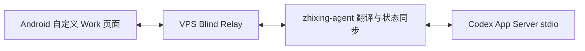
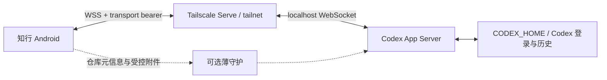

# 知行 Work 原生模式：产品、交互与架构合同

状态：Accepted target contract
日期：2026-07-19
跟踪：[GitHub Issue #66](https://github.com/rgywd/zhixing/issues/66)
适用范围：`v0.2.2` 之后的 Work 重构

> 本文是 Work 后续实现与验收的唯一产品基线。`ZHIXING_WIRE_V1.md`、
> `SELF_HOSTED_WIRE_RELAY.md` 和旧版 `CODEX_020_ROLLBACK.md` 只记录已经发布的
> 0.2.0–0.2.2 Wire 实现与回滚方法，不得继续约束新功能。

## 1. 一句话目标

知行在现有聊天产品内增加一个 Work 运行模式：Chat 继续承担普通 AI 对话，Work 以仓库为分组，
通过 Tailscale 内的加密 WebSocket 直接连接开发机 Codex App Server，并完整复用知行现有聊天页面。

Work 不是任务监控器、Happy 会话浏览器、远程桌面或另一套聊天产品。

## 2. 用户问题

0.2.2 已经证明 Codex Thread、Turn、Item 可以投影为知行的 `UIMessage/UIMessagePart`，也已经接入
现有 `ChatInput`。但整体体验仍然失败，原因不是消息组件缺失，而是产品层和通讯层各自多造了一套：

- 侧边栏有独立“工作”入口，打开后又进入项目首页和历史目录，形成与 Chat 平行的产品；
- Work 页面重新组织标题、列表、设置和状态，用户需要学习另一套导航；
- 模型、思考深度等控件依赖实时 Catalog 成功，弱网时无法使用；
- Relay 和 Agent 把 App Server 协议翻译成 Wire，再由 Android 重建状态，链路长且状态重复；
- Work 被设计成查看项目、历史和任务状态，而用户真正需要的是在手机上继续与 Codex 对话。

## 3. 产品决定

### 3.1 Chat 与 Work 是模式，不是分组

侧边栏保留现有结构。在现有分组栏右侧增加固定、紧凑的 `Chat / Work` 模式切换，不新增一行，
不增加第二个 Work 首页，也不再保留 Drawer 中重复的“工作”菜单项。

| 模式 | 左侧分组栏含义 | `+` 行为 | 右上角新建对话 |
|---|---|---|---|
| Chat | 普通对话文件夹，例如聊天、学术、日常 | 新建普通聊天分组 | 新建普通 AI 对话 |
| Work | Codex 仓库/workspace，例如 zhixing、worldattention | 添加仓库 | 在当前仓库新建 Codex Thread |

模式开关固定在分组栏右侧，不随横向仓库/文件夹列表滚动。模式选择、当前 Chat 文件夹、当前 Work 仓库
分别持久化，互不覆盖。

### 3.2 Work 的首页就是聊天

切换到 Work 后，主内容区直接展示当前仓库的聊天详情，不经过项目看板、任务表单或会话目录。

- 每个仓库保存一个“当前 Thread”指针；切换仓库恢复该 Thread。
- 尚未添加仓库时只显示最小空状态和“添加仓库”动作，不生成虚假项目、Thread 或任务面板。
- 仓库还没有当前 Thread 时，展示同一空白聊天壳；第一条发送时创建 Thread。
- 点击右上角新建按钮立即创建新的空白 Thread，并把它设为该仓库的当前 Thread。
- 新建前不询问“这次要实现什么”，不展示目标表单、远程操作目标卡或运行状态面板。
- Work 历史目录本期不展示；旧 Thread 不删除，后续可在不改变聊天主流程的前提下增加历史入口。

### 3.3 Work 分组就是仓库

Work 不再从 App Server 自动发现的全部 CWD 生成几十个不可管理的项目卡。仓库是用户明确添加、命名和排序的
本地配置：

```text
WorkRepository
  id                 手机本地稳定 ID
  displayName        侧边栏名称
  cwd                开发机绝对路径
  connectionId       所属开发机连接
  currentThreadId    当前 Thread，可空
  model              该仓库上次模型
  effortByModel      每模型上次思考深度
  permissionProfile  上次权限
  fastEnabled        上次 Fast
  order / enabled
```

仓库添加、改名、路径修改、排序和删除只改变手机端配置，不删除开发机目录或 Codex 历史。

## 4. 唯一聊天交互

### 4.1 必须复用的页面资产

Work Chat 必须从普通 Chat 提取并复用同一个页面壳，不允许制作“看起来类似”的第二套页面：

- 相同 Top Bar 结构、标题布局、模型副标题、新建和菜单动作；
- 相同聊天时间线、滚动、空状态和生成状态；
- 相同 Markdown、代码高亮、引用、选择复制；
- 相同 Reasoning、Chain of Thought、Tool、审批和错误展示；
- 相同 `ChatInputState`、输入框、附件预览、语音、IME、安全区、发送和停止；
- 相同图片、文件和分享进入聊天的行为。

Codex 只提供另一种 `ChatRuntimeController`，不得进入普通 Provider 的 `ChatService` 持久化链，也不得新增
`CodexItemRow`、独立 `OutlinedTextField` 或独立对话 Scaffold。

### 4.2 输入区

点击现有 `+` 继续打开现有底部面板：

- 拍照；
- 照片；
- 上传文件；
- 当前工作区；
- 扩展管理；
- 压缩历史。

附件选择后进入输入区预览，用户仍可补充文字，绝不自动发送。

Work 模式只在同一面板中增加：

- 访问权限开关/选项；
- Fast 开关；
- 当前仓库快捷切换。

这些能力不在输入框下方常驻铺设。

### 4.3 模型、思考深度和上下文

- 模型与思考深度使用客户端随版本发布的预设，进入页面即可选择。
- 每个仓库记住模型；每个模型分别记住思考深度。
- App Server 的 `model/list` 是后台兼容性刷新，不是控件启用门槛。
- 刷新成功后合并服务端能力和本地缓存；刷新失败只 Toast/状态提示，不锁死输入或选择器。
- 服务端明确拒绝某个模型、effort 或 Fast 时，显示原始可理解错误并回退到服务端确认值。
- 上下文用量来自 `thread/tokenUsage/updated`；暂时未知时显示“尚未同步”，不能阻止发送。

### 4.4 Skill、插件和指令

输入 `/` 时使用现有 `ChatCompletionProvider` 和完成弹层，展示可搜索、可分类的：

- Codex 内置指令；
- Skill；
- 已安装插件/App；
- 仓库相关 mention。

选择结果进入输入区，用户可以继续输入自然语言。Skill 和 mention 发送时保持 App Server 的结构化
`UserInput`，不能只拼成一段 `$name` 文本。任何工具列表都不得常驻铺在输入框下方。

## 5. 设置体系

不创建独立的 Work 设置首页。现有 `SettingPage` 增加一个使用 `CardGroup` 的 Work 卡片，沿用现有列表、
弹窗和 Bottom Sheet，包含：

- 开发机连接状态和连接/断开；
- 已添加仓库和默认仓库；
- App Server、Codex CLI 与协议版本；
- Tailscale/网络状态和诊断；
- 旧 Wire/Happy 只读回滚入口。

高频仓库切换在侧边栏；低频连接和仓库管理在 Work 卡片。删除 `Screen.CodexWorkflowSettings` 这类平行设置根路由。

## 6. 当前链路与目标链路

### 6.1 0.2.2 当前链路



Wire、Relay 和 Agent 分别维护快照、序列、ACK、Catalog、事件合并和命令映射。它们作为 0.2.2 回滚面保留，
但不是目标架构。

### 6.2 目标消息链路



核心约束：

- Android 直接收发 App Server JSON-RPC；消息不经过 VPS Relay 或翻译 Agent。
- App Server 只监听 `127.0.0.1`，不裸露到公网或共享局域网。
- Tailscale Serve 在 tailnet 内终止 TLS 并反向代理 localhost；正式路径必须使用 `wss://`。
- App Server WebSocket 使用独立高熵 capability token 或 signed bearer token；不得复用 Codex/OpenAI 登录 token。
- 薄守护不读取、翻译、重排或存储 Thread/Turn/Item 消息。

OpenAI 官方将 App Server 用于富客户端集成，但 WebSocket transport 仍标为 experimental/unsupported；
因此必须固定 Codex 版本、生成 schema 并做兼容门。参考：

- [Codex App Server](https://learn.chatgpt.com/docs/app-server.md)
- [Tailscale Serve](https://tailscale.com/docs/features/tailscale-serve)
- [tailscale serve command](https://tailscale.com/docs/reference/tailscale-cli/serve)

## 7. 薄守护边界

保留 `zhixing-agent` 包名可避免已有安装和升级入口断裂，但目标职责改名为 supervisor：

允许：

- 检查、启动、停止和重启固定版本的 `codex app-server`；
- 创建/轮换 transport token；
- 检查 `/readyz`、`/healthz`、CLI/App Server 版本和 schema hash；
- 读取用户明确允许的仓库候选元信息；
- 接收手机附件，做大小、MIME、SHA-256、路径和 TTL 校验后写入专用目录；
- 输出不含密钥、正文和完整敏感路径的诊断。

禁止：

- 代理或翻译 App Server JSON-RPC；
- 维护另一套 Thread/Turn/Item 状态机；
- 合并流式消息或 Catalog；
- 将消息上传 VPS；
- 持有 ChatGPT/Codex 登录凭据；
- 暴露通用文件系统、Shell 或任意路径上传接口。

## 8. 数据与缓存

### 8.1 事实来源

- Codex App Server 是 Thread、Turn、Item、审批和运行设置的唯一事实来源。
- Room 只保存离线渲染所需缓存、草稿、当前 Thread 指针、仓库配置和最后确认的能力。
- 普通 Provider Conversation 与 Codex Thread 不能合并成同一持久化对象。
- 历史 snapshot 和实时 notification 必须继续经过同一个 `CodexRuntimeItemReducer` 与
  `CodexMessageProjector`，得到相同 `UIMessagePart`。

### 8.2 离线语义

- 开发机休眠、关机或 Tailscale 不可达时，已缓存当前 Thread 可读，草稿可编辑。
- 离线不排队发送、审批或危险操作；恢复后由用户重新发送或重试。
- 断线期间保留旧 revision，不用空响应覆盖历史。
- 重连后先 `initialize`，再读取当前 Thread 快照，然后订阅/处理新通知。

## 9. 安全合同

- Android 连接信息和 transport token 使用 Android Keystore 保护，不进入日志、崩溃报告或 URL。
- App Server 绑定 localhost；Tailscale ACL 只允许用户自己的手机设备访问。
- 非本机连接必须是 `wss://`；明文 `ws://` 只允许 localhost 测试。
- Bearer 在 WebSocket HTTP Upgrade 时发送，认证完成后才允许 `initialize`。
- 薄守护附件目录固定、不可通过用户输入逃逸；文件具备大小上限、哈希和自动清理时间。
- 手机不持有 Codex/OpenAI 登录 token；模型请求仍从开发机发出。
- Tailscale 只解决加密可达性，不用于规避账号、地区或平台政策。

## 10. 版本与降级

- 首个目标固定为本机已验证的 `codex-cli 0.144.0`，并提交该版本生成的协议 schema hash。
- 连接时比较 CLI 版本、initialize capability 和 schema compatibility，不能只比较版本字符串。
- 未知 notification 保存为 opaque 诊断对象，不能使整个 Thread 崩溃。
- 必需写能力不兼容时进入“缓存只读”；Chat 模式继续正常工作。
- WebSocket 队列返回 `-32001 Server overloaded` 时使用带 jitter 的指数退避，不立即循环重试。
- Catalog、Skill、插件或上下文刷新失败只降级对应能力，不锁死聊天。

## 11. 迁移与回滚

- 现有 Room 31、Wire 密文、Relay 数据、Agent home 和 Happy 数据不在本需求中删除。
- 先增加 direct transport 和双模式 UI，在内部开关下完成真实链路验收，再把 Work 默认切到 direct。
- 切换后 Wire/Relay 进入只读回滚状态；稳定一个发布周期后另开清理需求删除死代码和服务器资源。
- 已缓存 Codex Item 可继续投影；直连首次读取成功后按 Thread revision 原子更新。
- 回滚只切换 transport/controller，不迁移或删除 Codex 原始历史。

## 12. P0 验收矩阵

| 用户要求 | 必须证据 |
|---|---|
| Chat/Work 不单独占一行 | Drawer 截图与 Compose 测试；开关固定在现有分组栏右侧 |
| Work 分组是仓库 | 仓库增删改、选择持久化和不删除远端数据的测试 |
| 无 Work 首页/任务表单 | 切换 Work 和新建 Thread 直接进入共享空白聊天壳 |
| 复用原聊天详情 | Chat 与 Work 使用同一 Scaffold/Timeline/Composer 组件；无第二套输入框 |
| 图片和文件 | 现有 + Sheet 选择、预览、受控上传；图片走 `localImage`，通用文件走受控本机路径清单（官方协议无通用 file item） |
| 模型/思考不锁死 | 无网络/无 Catalog 时客户端预设可选；服务端拒绝后的明确回退测试 |
| 权限与 Fast 收拢 | 只在 Work 的现有 + Sheet 中显示并随 Turn 生效 |
| `/` 指令 | CompletionProvider 展示 Skill/插件/指令，选择后结构化发送 |
| 原生消息体验 | Markdown、Reasoning、Tool、审批、流式与历史重放等价测试 |
| 设置不另造体系 | 现有 SettingPage 的 Work CardGroup；无独立设置首页 |
| 一跳数据面 | 抓包/日志证明 Android JSON-RPC 直达 App Server；Relay/Agent 不见消息 |
| 弱网恢复 | Wi-Fi、5G、开发机休眠和 Tailscale DERP 场景；无重复、无空历史覆盖 |
| 普通 Chat 无回归 | 分组、会话、附件、模型、语音、发送/停止与设置回归测试 |

## 13. 非目标与延期

- Work 历史会话目录、归档与全量搜索本期不展示。
- 不做任务监控首页、远程目标卡、项目仪表盘或运行日志首页。
- 不做完整 IDE、通用终端、任意文件浏览器或移动 Diff 编辑器。
- 不附着 ChatGPT Desktop 的私有 stdio 子进程，不读取其私有 SQLite 伪造实时事件。
- 不恢复 Claude Code 写入链路。
- 不在本需求内删除旧 Wire/Happy 数据或立刻下线 VPS。
- Tailscale Serve 对 App Server WebSocket Upgrade 必须在开发机完成真实探针；未通过时只允许用同一
  tailnet 内的最小 TLS 终止层替换，不能恢复业务协议网关。

## 14. 实施保护规则

1. 不使用新 worktree；从最新 `main` 创建 `feat/66-*` 短分支。
2. 文档、协议 contract test 和失败测试先于产品切换。
3. 每阶段必须让 `main` 候选保持可构建，普通 Chat 不得被 Work 开发破坏。
4. Wire/Relay 的删除必须晚于 direct 真机验收和一个版本周期，不在同一提交中同时切换和销毁回滚面。
5. 发布前由独立审查 BOT 逐项标记 P0 为 PASS / FAIL / NOT PROVEN；任一项非 PASS 不得发布。
